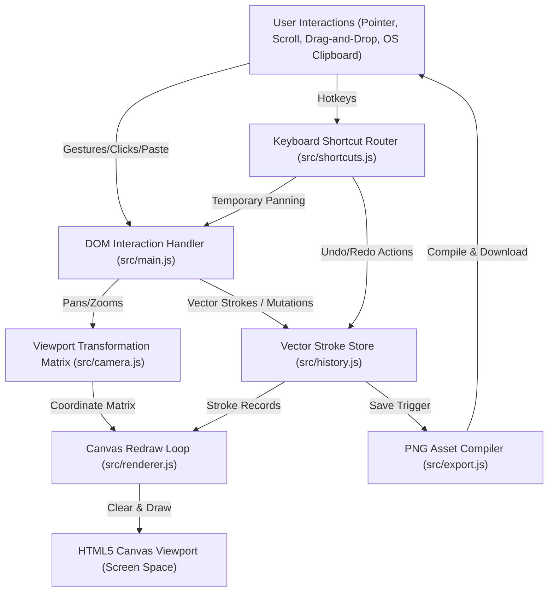
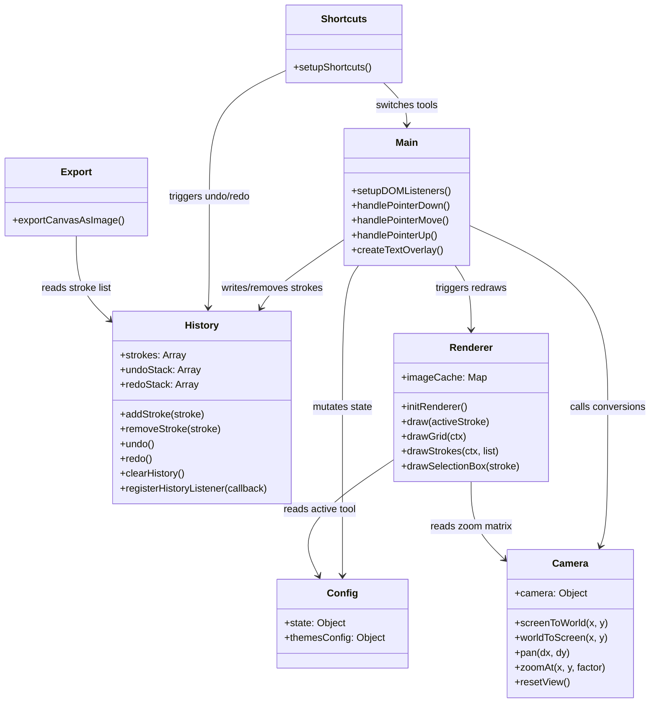

# CodingHelp - Digital Teaching Board

A premium, high-performance, distraction-free digital blackboard and whiteboard application featuring an **Infinite Vector Canvas** with rich multiline text support, image overlays, shape layers, dynamic grid systems, high-resolution PNG exports, and advanced interactive capabilities.

---

## 🛠️ Technology Stack

The application is built entirely on standard Web APIs and modern front-end tooling to guarantee near-instantaneous load times, smooth rendering loops, and high maintainability:

1. **Core Language & Scripting**: 
   - **ES6 JavaScript Modules**: Component-driven architecture using native ECMAScript modules for logical isolation.
   - **HTML5 Canvas 2D API**: Dynamic, pixel-level vector rendering through `CanvasRenderingContext2D` transformations.
2. **Styling & Presentation**:
   - **Vanilla CSS3**: Leverages HSL color spaces, custom CSS variables for design system tokens, flexible flexbox/grid layouts, and `backdrop-filter: blur(16px)` glassmorphism.
   - **Google Fonts**: Outfit (modern UI elements) and Playfair Display (brand typography).
3. **Build Tooling & Development Server**:
   - **Vite v5**: High-speed local HMR (Hot Module Replacement) and optimized bundling wrapper.
4. **Offline & Integration**:
   - **PWA Manifest**: Web application standard parameters (`manifest.json`) for desktop and mobile local installations.

---

## 📐 Architectural High Level Design (HLD)

The application behaves as a **Single Page Application (SPA)** utilizing a unidirectional data flow model. Interactive coordinates mapped on the screen are translated into vector coordinates in World Space, committed to a state container, and redrawn dynamically.

### System Architecture Flow



### High-Level Subsystems

1. **Input Controller**: Receives pointer captures (support for mouse, stylus, touch) and keyboard keys to decide active actions (drawing, zooming, panning, text entry, select/move, and resize).
2. **Coordinate Transformer**: Converts device-independent screen pixels to virtual infinite-grid coordinates depending on zoom level and panning offsets.
3. **State Container**: Holds current selection data (chalk color, brush size, active tool, selected stroke, clipboard stroke) and historical records of drawn items.
4. **Drawing Pipeline**: A high-efficiency render engine that cleans, applies scaling matrices, constructs grids, renders vector paths, and overlays active selection bounding boxes.
5. **Asset Exporter**: Translates vector layers into static raster drawings on a high-definition offline Canvas context for direct device download.

---

## ⚙️ Low Level Design (LLD)

### 1. Vector Stroke Schema

All actions on the board are represented as vector stroke structures, enabling lossless scalability, undo/redo states, and zoom-invariant rendering:

```javascript
// Stroke Structure Schema
{
  tool: 'pen' | 'select' | 'eraser' | 'line' | 'rectangle' | 'circle' | 'text' | 'image',
  color: '#ffffff' | 'transparent', // CSS color swatch string
  size: Number, // Nominal brush width or font scale factor
  points: [
    { x: Number, y: Number }, // top-left coordinate (or baseline for text)
    { x: Number, y: Number }  // bottom-right coordinate (or top-right for text)
  ],
  text: String, // Optional: Holds message content if tool === 'text'
  dataURL: String // Optional: Holds base64 image data if tool === 'image'
}
```

### 2. Module Interactions



### 3. Coordinate Conversion Pipeline

When a user interacts with the canvas, coordinates must flow through coordinate mapping translations:

```
[Screen Space (Pixels)]
         │
         ▼   (clientX - CanvasLeft) / (clientY - CanvasTop)
[Viewport Screen Coordinates]
         │
         ▼   screenToWorld(): Subtract camera.x/y offsets, divide by camera.zoom
[Virtual World Space (Infinite coordinates saved to Stroke history)]
         │
         ▼   worldToScreen() / ctx.setTransform(): Apply camera zoom matrix
[Canvas Context Render (Drawn to display screen)]
```

---

## 🎨 Interactive Engine Specifications

### 1. Element Selection & Translation (Move)
- When the Selection Tool is active (`V`), pointer down triggers a hit-test against all text and image strokes in reverse order (top-most elements first).
- A matching element is set as `state.selectedStroke`. The renderer wraps it in a dashed bounding box with a resize handle.
- Dragging inside the box translates both points:
  $$\Delta x = \text{currentWorldX} - \text{startWorldX}$$
  $$\Delta y = \text{currentWorldY} - \text{startWorldY}$$
  $$P_0' = P_{0,\text{start}} + (\Delta x, \Delta y)$$
  $$P_1' = P_{1,\text{start}} + (\Delta x, \Delta y)$$

### 2. Proportional Scaling (Resize)
- Dragging the bottom-right handle triggers resize mode.
- **Images**: Freely adjusts $P_1$ (bottom-right coordinate) to the cursor world position.
- **Text**: Resizes relative to the top-left anchor $P_0$. The scale factor is determined by height changes:
  $$\text{scale} = \frac{|y_{\text{cursor}} - y_{0,\text{start}}|}{|y_{1,\text{start}} - y_{0,\text{start}}|}$$
  $$\text{size}' = \max(2, \text{round}(\text{size}_{\text{start}} \times \text{scale}))$$
- Font metrics are re-measured, recalculating width ($w$) and combined height ($h$). Bounding coordinates are updated:
  $$P_1.x = P_0.x + w$$
  $$P_1.y = P_0.y + h$$

### 3. Multiline Formatting
- Text strings containing `\n` (newlines) are split and drawn line-by-line using a line height multiplier of $1.2 \times \text{fontSize}$.
- Textarea inputs expand dynamically as users type. Pressing `Enter` adds a newline, and `Ctrl + Enter` submits.

### 4. Advanced Clipboard Integration
- **Copy/Paste (`Ctrl+C` / `Ctrl+V`)**: Copies the selected canvas stroke. Pasting duplicates it offset by $+20$ world units.
- **OS Screenshot/File Paste**: Pasting image files from the operating system clipboard immediately decodes, centers, and selects them on the canvas.
- **OS Text Paste**: Pasting raw code blocks or text snippets immediately formats them as multiline text blocks centered in the active view, activates the Selection Tool, and selects the pasted block.
- **Deletion**: Pressing `Delete` or `Backspace` deletes selected elements immediately.

### 5. Double-Collapse Sidebar Architecture
- **Off-Screen Collapsing**: Top and bottom panels slide completely off-screen by translating $68\text{px}$ (desktop) or $60\text{px}$ (mobile).
- **Sticky Chevron Toggles**: The collapse chevrons counter-translate by the same amount, remaining pinned to the screen margin with a separate glassmorphism border and box-shadow. They transition smoothly using CSS transforms.

---

## 🎨 Design Patterns Used

1. **Memento Pattern (Undo/Redo System)**:
   - Configured in [src/history.js](file:///e:/JavaProject/simple-teaching-board/src/history.js).
   - Deep copies of stroke arrays are stored in `undoStack` and `redoStack`. In-place transformations (moving, resizing) only commit state snapshots on `pointerup`.
2. **Model-View-Controller (MVC) Design**:
   - **Model**: Centralized state management in [src/config.js](file:///e:/JavaProject/simple-teaching-board/src/config.js) and vector histories in [src/history.js](file:///e:/JavaProject/simple-teaching-board/src/history.js).
   - **View**: Handled by [style.css](file:///e:/JavaProject/simple-teaching-board/style.css) and [src/renderer.js](file:///e:/JavaProject/simple-teaching-board/src/renderer.js).
   - **Controller**: Managed in [src/main.js](file:///e:/JavaProject/simple-teaching-board/src/main.js) and keyboard routers in [src/shortcuts.js](file:///e:/JavaProject/simple-teaching-board/src/shortcuts.js).
3. **Facade / Coordinate Transform Wrapper**:
   - Complex scaling and translating matrices are enclosed under [src/camera.js](file:///e:/JavaProject/simple-teaching-board/src/camera.js), presenting clean conversions APIs.
4. **Flyweight / Image Asset Caching**:
   - Stores decoded `HTMLImageElement` references in an internal map to prevent canvas re-drawing lag.
5. **State Observer Pattern**:
   - The history repository triggers callbacks to update the state of the top toolbar's Undo/Redo buttons.

---

## 🚀 Running the Project Locally

### Prerequisites
Make sure you have [Node.js](https://nodejs.org/) installed.

### 1. Install Dependencies
```bash
npm install
```

### 2. Start the Development Server
```bash
npm run dev
# or
npm start
```
Open [http://localhost:5173/](http://localhost:5173/) in your web browser.

### 3. Build for Production
```bash
npm run build
```
This builds optimized production bundles inside the `dist/` folder.
