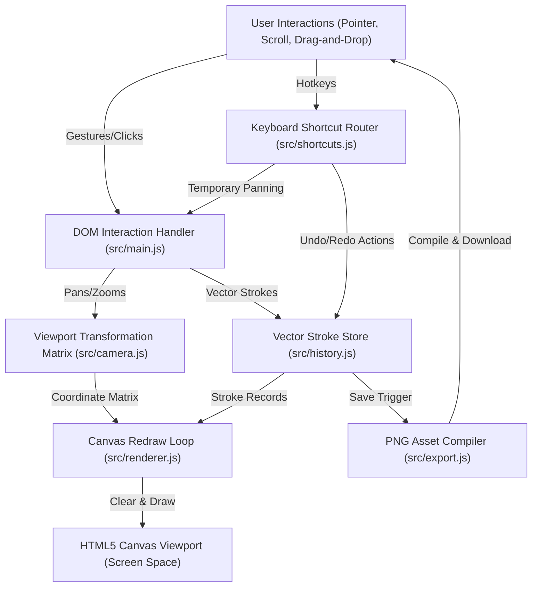
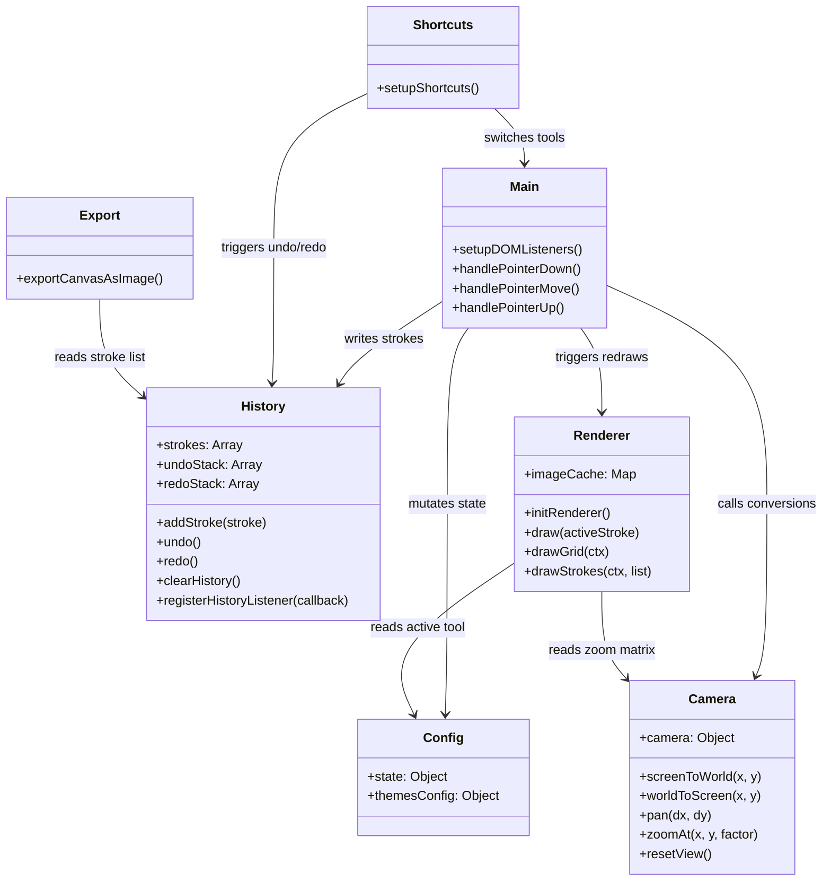

# CodingHelp - Digital Teaching Board

A premium, high-performance, distraction-free digital blackboard and whiteboard application featuring an **Infinite Vector Canvas** with rich text support, image overlays, shape layers, dynamic grid systems, and high-resolution exports.

---

## 🛠️ Technology Stack

The application is built entirely on standard Web APIs and modern front-end tooling to guarantee near-instantaneous load times, smooth rendering loops, and high maintainability:

1. **Core Language & Scripting**: 
   - **ES6 JavaScript Modules**: Component-driven architecture using native ECMAScript modules for logical isolation.
   - **HTML5 Canvas 2D API**: Dynamic, pixel-level vector rendering through `CanvasRenderingContext2D` transformations.
2. **Styling & Presentation**:
   - **Vanilla CSS3**: Leverages HSL color spaces, custom CSS variables for design system tokens, flexible flexbox/grid layouts, and `backdrop-filter: blur(16px)` glassmorphism.
   - **Google Fonts**: Outfit (modern UI elements) and Playfair Display (brand typography).
3. **Build Tooling & Development Server**:
   - **Vite v5**: High-speed local HMR (Hot Module Replacement) and optimized bundling wrapper.
4. **Offline & Integration**:
   - **PWA Manifest**: Web application standard parameters (`manifest.json`) for desktop and mobile local installations.

---

## 📐 Architectural High Level Design (HLD)

The application behaves as a **Single Page Application (SPA)** utilizing a unidirectional data flow model. Interactive coordinates mapped on the screen are translated into vector coordinates in World Space, committed to a state container, and redrawn dynamically.

### System Architecture Flow



### High-Level Subsystems

1. **Input Controller**: Receives pointer captures (support for mouse, stylus, touch) and keyboard keys to decide active actions (drawing, zooming, panning, text entry).
2. **Coordinate Transformer**: Converts device-independent screen pixels to virtual infinite-grid coordinates depending on zoom level and panning offsets.
3. **State Container**: Holds current selection data (chalk color, brush size, active tool) and historical records of drawn items.
4. **Drawing Pipeline**: A high-efficiency render engine that cleans, applies scaling matrices, constructs grids, and renders vector paths.
5. **Asset Exporter**: Translates vector layers into static raster drawings on a high-definition offline Canvas context for direct device download.

---

## ⚙️ Low Level Design (LLD)

### 1. Vector Stroke Schema

All actions on the board are represented as vector stroke structures, enabling lossless scalability, undo/redo states, and zoom-invariant rendering:

```javascript
// Stroke Structure Schema
{
  tool: 'pen' | 'eraser' | 'line' | 'rectangle' | 'circle' | 'text' | 'image',
  color: '#ffffff' | 'transparent', // CSS color swatch string
  size: Number, // Nominal brush width in pixels
  points: [
    { x: Number, y: Number } // Array of coordinates in World Space (relative to center 0,0)
  ],
  text: String, // Optional: Holds message content if tool === 'text'
  dataURL: String // Optional: Holds base64 image data if tool === 'image'
}
```

### 2. Module Interactions



### 3. Coordinate Conversion Pipeline

When a user interacts with the canvas, coordinates must flow through coordinate mapping translations:

```
[Screen Space (Pixels)]
         │
         ▼   (clientX - CanvasLeft) / (clientY - CanvasTop)
[Viewport Screen Coordinates]
         │
         ▼   screenToWorld(): Subtract camera.x/y offsets, divide by camera.zoom
[Virtual World Space (Infinite coordinates saved to Stroke history)]
         │
         ▼   worldToScreen() / ctx.setTransform(): Apply camera zoom matrix
[Canvas Context Render (Drawn to display screen)]
```

---

## 🎨 Design Patterns Used

1. **Memento Pattern (Undo/Redo System)**:
   - Configured in [src/history.js](file:///e:/JavaProject/simple-teaching-board/src/history.js).
   - The system preserves snapshots of the vector canvas states. `undoStack` and `redoStack` store deep copies of stroke records, enabling 40-step rollback states.
2. **Model-View-Controller (MVC) Design**:
   - **Model**: Centralized state management in [src/config.js](file:///e:/JavaProject/simple-teaching-board/src/config.js) and the vector histories list in [src/history.js](file:///e:/JavaProject/simple-teaching-board/src/history.js).
   - **View**: Controlled by layout sheets ([style.css](file:///e:/JavaProject/simple-teaching-board/style.css)) and the render pipelines ([src/renderer.js](file:///e:/JavaProject/simple-teaching-board/src/renderer.js)).
   - **Controller**: Bound via user gestures in [src/main.js](file:///e:/JavaProject/simple-teaching-board/src/main.js) and keyboard listeners in [src/shortcuts.js](file:///e:/JavaProject/simple-teaching-board/src/shortcuts.js).
3. **Facade / Modular Helper Pattern**:
   - Coordinate conversions, vector calculations, and camera states are consolidated under [src/camera.js](file:///e:/JavaProject/simple-teaching-board/src/camera.js). The remainder of the application interacts with clean, simple coordinate transformation functions.
4. **Flyweight / Image Asset Caching**:
   - Drawing base64 data URLs in a render loop causes latency due to image decoding. [src/renderer.js](file:///e:/JavaProject/simple-teaching-board/src/renderer.js) instantiates an internal `imageCache` map storing decoded `HTMLImageElement` references, avoiding repetitive file loading calls.
5. **State Observer Pattern**:
   - The history repository notifies registered listeners when the undo/redo availability updates, automatically updating the state of the top toolbar action buttons.

---

## 🚀 Running the Project Locally

### Prerequisites
Make sure you have [Node.js](https://nodejs.org/) installed.

### 1. Install Dependencies
```bash
npm install
```

### 2. Start the Development Server
```bash
npm run dev
# or
npm start
```
Open [http://localhost:5173/](http://localhost:5173/) in your web browser.

### 3. Build for Production
```bash
npm run build
```
This builds optimized production bundles inside the `dist/` folder.
